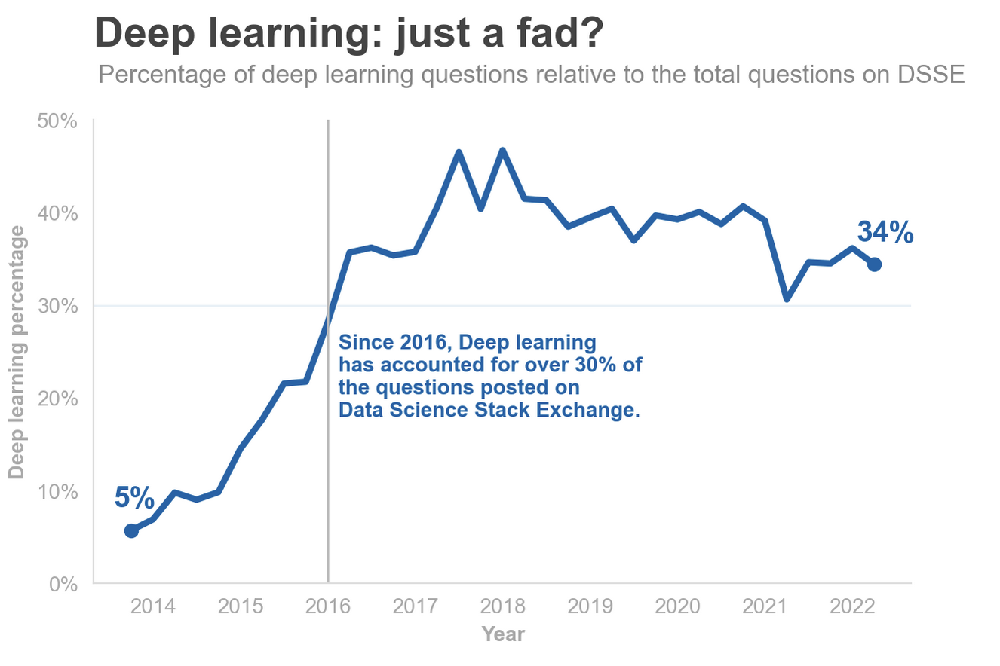

# Popular Data Science Questions
## Overview
In this project, we assume the role of Data Analysts working in a company that creates Data Science content. The content can be in the form of books, online articles, videos or interactive text. We have been tasked with determining the best content to write about for maximum user engagement.

## Approach
To address this task, we decide to collect data from [stack exchange](https://en.wikipedia.org/wiki/Stack_Exchange), a network of question-and-answer websites. Stack Exchange hosts sites on various fields and subjects, including Mathematics, Physics, Statistics, and Data Science! Our rationale is simple: If we can identify Data Science questions that people commonly ask, then we can tailor our content to address those topics.

We selected Stack Exchange because it provides relevant, easy to identify and well-maintained information about data science on its Data Science Stack Exchange (DSSE) website. Stack Exchange also provides a public database for each website, making it easy to get relevant information where necessary.

## Workflow
The Wrangling process involved gathering relevant data from the Stack Exchange Database with Transact-SQL. Cleaning involved converting data types and tidying up the dataset columns.

Analysis was directed towards identifying the most popular topics, how they are used in combination with one another, and the trend in the popularity of selected topics over time.

## Findings
Machine learning, python and deep learning are the most popular data science topics on DSSE. However, due to the broad nature of machine learning and python, we focused on the relatively narrower alternative - **deep learning**.

 

Interestingly, deep learning has grown in popularity on DSSE, rising from over 5% of total DSSE questions in 2014 to over 30% in 2016. Though this growth appears to have plateaued, deep learning still accounts for over 30% of questions posted on DSSE to date. This signifies that its popularity is not just a short-lived one. Instead, it is a growing field of data science that people continue to engage with and explore.

## Recommendation
Based on our discovery, we advise tailoring our resources to address deep learning content since it promises a potential for audience interaction and engagement in the data science space. In addition, we suggest considering non-data-science content to write about. This can offer avenues for diversification and enable us to appeal to a larger audience in the long run.

